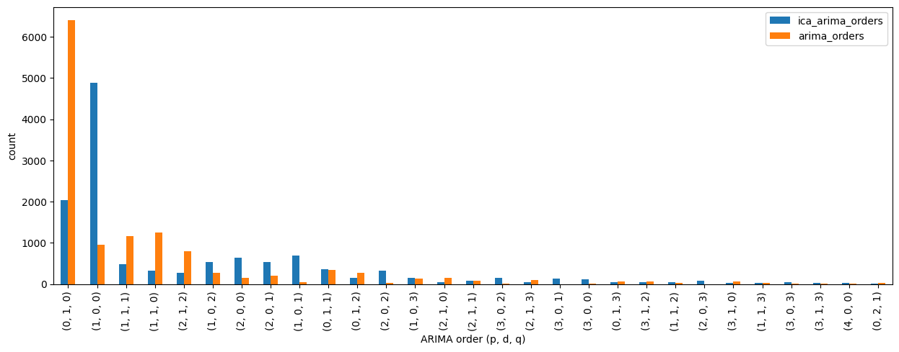

  # Empirical Results
  ## R (Pearson Correlation)
 - **Pearson Correlation** of ica_arima **better** than just arima


```python
# %%

pearsonr(df_ret, df_ica_pred, alternative="greater"), \
    pearsonr(df_ret, df_arma_pred, alternative="greater")
```


    (PearsonRResult(statistic=0.01340416190293595, pvalue=0.0630091125365575),
     PearsonRResult(statistic=0.005678315103859606, pvalue=0.2584545828881826))

 ## Directional accuracy
 - Diebold Mariano test shows **Directional Accuarcy** (correct sign of returns predicted) for ica_arima significantly **better** than arima

```python
#%%

print("Diebold Mariano test statistic, p-value:",
dm_test(
    np.sign(df_ret).values,
    np.sign(df_ica_pred).values,
    np.sign(df_arma_pred).values,
    loss=lambda a, b: abs(a - b),
    one_sided=True))
```

    Diebold Mariano test statistic, p-value: (-1.1580454616279916, 0.12343335583198067)

 ## Mean Absolute Error
 - Diebold Mariano test shows **Mean Absolute Error** of ica_arima predicitons significantly **better** than arima


```python
#%%

print("Diebold Mariano test statistic, p-value:",
dm_test(
    df_ret.values,
    df_ica_pred.values,
    df_arma_pred.values,
    loss=lambda a, b: abs(a - b),
    one_sided=True))
```

    Diebold Mariano test statistic, p-value: (-10.756302880194324, 3.5880904215227915e-27)

 ## Mean Squared Error
 - Diebold Mariano test shows **Mean Squared Error** of ica_arima predicitons significantly **better** than arima


```python
#%%

print("Diebold Mariano test statistic, p-value:",
dm_test(
    df_ret.values,
    df_ica_pred.values,
    df_arma_pred.values,
    loss=lambda a, b: (a - b)**2,
    one_sided=True))
```

    Diebold Mariano test statistic, p-value: (-6.523036238661388, 3.572181247611614e-11)

 ## Comaparison of ARIMA orders
 - for just ARIMA the AutoARIMA algorithm determined Brownian Noise with order (0, 1, 0) to be the best model of the process
 way more often than for ica + ARIMA, indicating application of ICA improved the Signal to Noise Ratio


```python
#%%

n_train_days = 120
tick = "24h"
ica_orders = pd.read_csv(f"../data/ica_arma_orders_{tick}_{n_train_days}D.csv", index_col=0)
arima_orders = pd.read_csv(f"../data/arma_orders_{tick}_{n_train_days}D.csv", index_col=0)
orders = pd.concat((
    ica_orders.unstack().value_counts().rename("ica_arima_orders"),
    arima_orders.unstack().value_counts().rename("arima_orders")
    ), axis=1, join="inner")

orders.iloc[np.argsort(orders.sum(axis=1))[:-30:-1]].plot.bar(figsize=(15, 5))
plt.xlabel("ARIMA order (p, d, q)")
plt.ylabel("count")
```
    

    


  ### Source paper
 Oja, Erkki, Kimmo Kiviluoto, and Simona Malaroiu. "Independent component analysis for financial time series." Proceedings of the IEEE 2000 Adaptive Systems for Signal Processing, Communications, and Control Symposium (Cat. No. 00EX373). IEEE, 2000.
 [doi.org/10.1109/ASSPCC.2000.882456](https://doi.org/10.1109/ASSPCC.2000.882456)
